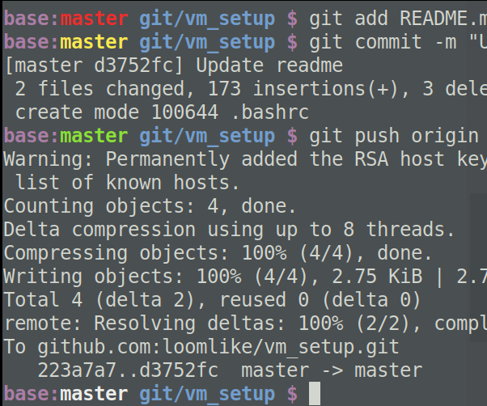

# Get Ready to Work on Linux (Virtual) Machines

Setup a linux machine for data science work & python dev.

## Table of Contents

1. Configure **ssh**
2. Beautify **bash**
3. Setup **git**
4. Config VScode
5. Jupyter
6. Extras
    * Setup 100 VMs with a single script via Azure VMSS
    * WSL (windows subsystem for linux)

## 1. Configure **ssh**
To set ssh config:
```
# ~/.ssh/config
Host {my_vm_name}
    HostName     {my_vm_address}
    User         {my_vm_account}
    LocalForward {port_to_tunnel} localhost:{port_to_tunnel}
    ForwardAgent yes
```

To change ssh port:
```
# 1. Set `Port`:
sudo vi /etc/ssh/sshd_config

# 2. Restart sshd service:
sudo systemctl restart sshd

# 3. Confirm change
sudo netstat -tulpn | grep ssh

# 4. (Optional) Add a rule to nsg (if use Azure VM)

# 5. Connect by specifying the port
ssh -p PORT_NUMBER USER_NAME@IP_ADDRESS
```

## 2. Beautify **bash**
Copy .bashrc file to the home directory:
`cp .bashrc ~/.bashrc`

This will change the bash prompt to be:
`current_conda_env:current_git_branch(if dir is a git repo) trimmed_working_dir $ `

E.g.,
`base:master ~/.../git/vm_setup $`

The branch status will be shown as colors: clean - white, dirty - red, staged - yellow, committed - green:



## 3. Setup **git**

```
git config --global user.name {my_name}
git config --global user.email {my_github_email}
git config --global core.editor "vi"
```

## 4. VScode for **python**

## 5. Jupyter
```
jupyter notebook --generate-config

# then edit the generated `jupyter_notebook_config.py` to be:
# c.NotebookApp.open_browser = False
```
> Note, Azure DSVM's JupyterHub config path is `/etc/jupyterhub/jupyterhub_config.py`

Enable widgets:
```
jupyter nbextension enable --py widgetsnbextension
```

Change Jupyter Theme:
```
pip install jupyterthemes
jt -t grade3 -fs 95 -tfs 11 -nfs 115 -cellw 90% -T -N
```


## 6. Extras

### Setup 100 VMs with a single script via Azure VMSS

This section shows how to setup multiple Azure Data Science Virtual Machines (DSVMs) with multiple user accounts.
More specifically, it deploys Azure VMSS (Virtual Machine Scale Set) and invokes the post-deployment-script on each VM instance
to:
1. Clone an example project repository,
1. Setup conda environment for the project, and
1. Create multiple JupyterHub users (Each user can access JupyterHub by opening `https://vm-ip-address:8000`)

### WSL (windows subsystem for linux)

- [Windows Terminal](https://github.com/microsoft/terminal) config
    ```
    "defaults":
        {
            "cursorColor" : "#ffdb59",
            "cursorHeight" : 100,
            "cursorShape" : "vintage",
            "fontFace" : "Fira Code",
            "fontSize" : 10,
            "colorScheme": "One Half Dark"
        },
    ```
- Transparent terminal by using AutoHotKey ([related thread](https://github.com/microsoft/terminal/issues/1753))
    ```
    #^Esc::
     WinGet, TransLevel, Transparent, A
     If (TransLevel = OFF) {
       WinSet, Transparent, 200, A
     } Else {
       WinSet, Transparent, OFF, A
     }
    return
    ```

